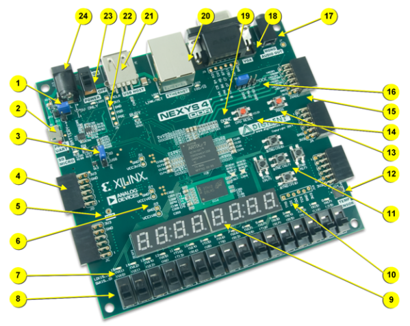
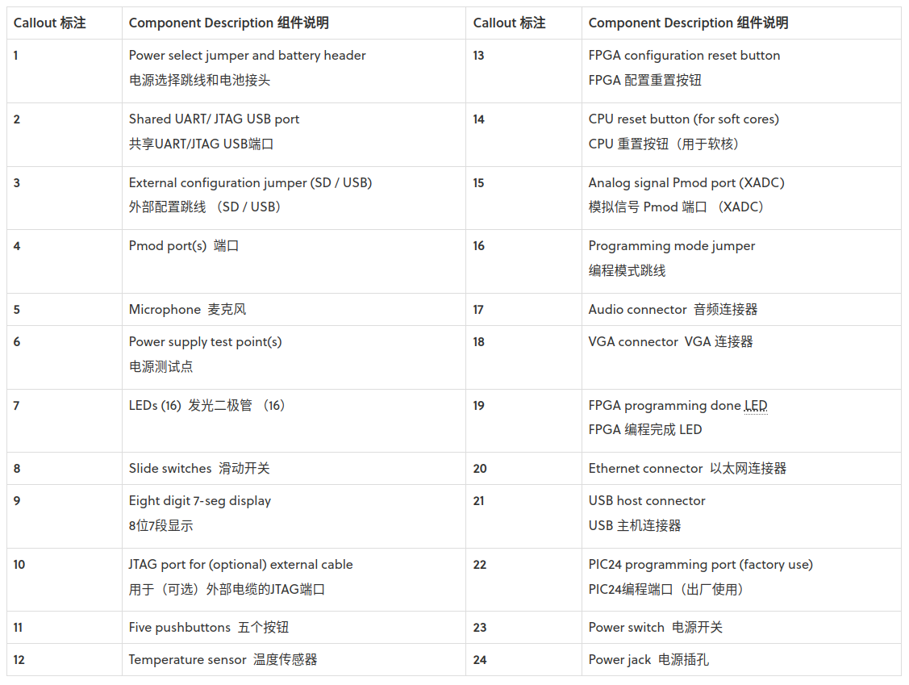
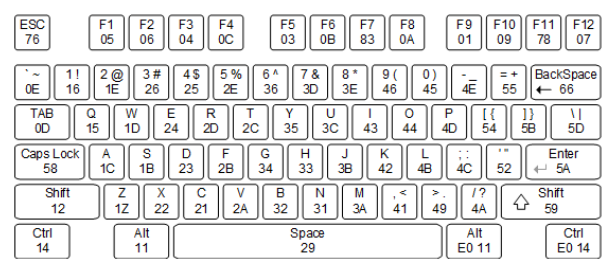

# Basic

HomePage：https://digilent.com/reference/programmable-logic/nexys-4-ddr/start

Reference Manual：https://digilent.com/reference/programmable-logic/nexys-4-ddr/reference-manual

# Features

- 15,850 logic slices
- 4,860 Kbits of fast block RAM

- 我主观认为限制 verilog 中定义数据量大小的应该是上述两者
    - 没有找到更相关的数值
    - 一个讨论参考：https://forum.digilent.com/topic/4128-nexys-4-ddr-storing-data-in-memory/

# Component

## Jumper
- 跳线，可以手动切换从而改变
- 必须在断电的状态下进行切换

### JP1
- 控制编程模式（JTAG / SPI / USB）
- 和 Configuration Way 关联

### JP2
- 控制外部配置（USB / SD）
- 从这个角度来说是 JP1 的辅助，两个就一起看吧

### JP3 
- 控制电源输入来源
- 默认是 USB-JTAG 接口
- 还可以使用外部电源 / 外部电池组
    - 外部电源指 5V1A 2.1mm 同轴电缆圆孔插头，可以在淘宝买到
    - 外部电池组 5V 电池即可，搜了一下似乎说可以用鳄鱼夹电池盒，淘宝可买
        - 嗯，好像也可以直接用电线去皮缠金属丝

## Configuration Way

- 比特流存储在 SRAM-based memory cells 中

### USB-JTAG 编程
- 也就是我们一般使用的，通过电脑连线向板内的 SRAM 传输 bitstream
- 关于 JATG：
    - 全称 Joint Test Action Group，最初用于 PCB 板测试
    - 可以用来对板子修改信号做 DEBUG 测试，但是对我们来说太复杂了x

### SPI 端口传输
- 同样是通过 vivado，但传到非易失性闪存器件
- 断电后只要重新上电就会自动复位，无需再次传送 bitstream
- 写非常慢 (4-5min)，但是配置非常快 (1s)

### Micro SD Card
- FAT32 文件系统，单个 .bit 文件放在根目录中
- 可以自动读取
- 插槽在板子背面 (J1)
- 单卡和读卡器都可以在淘宝买到

### USB
- 和 Micro SD Card 的前两点一致
- 插槽是 USB HOST (J5)
    - 坏消息是 USB HOST 不支持 hub，而我们又要用键盘
    - 所以如果想要用这个，似乎只能先连一次 USB 让它读完 bitstream，再连键盘控制

## Memory
- 128MiB 的 DDR2 SDRAM，可以通过官网提供的 DDR-to-SRAM adapter module 方便交互，也有更复杂的写法
- 16MiB 的 non-volatile serial Flash device，对应前面说的 SPI 端口传输

## USB-UART Bridge
- 和 USB-JTAG 是同一个部件(J6)，两个电路之间互不干扰
- 关于 UART:
    - 全称 Universal Asynchronous Receive Transmit，异步接收传输串行协议(?)
    - 可以通过该部件实现电脑和 FPGA 板的数据双向传输
    - linux 可以方便地读取从 COM (cluster communication port) 串行端口接收到的数据

## USB HID Host
- 也就是板上的 USB HOST
- 不支持 hub，所以鼠标键盘只能二选一
- 关于 HID
    - Universal Serial Bus-Human Interface Device

### KeyBoard

- 每个按键都被分配了一个唯一的 code
- 每次按键时发送对应 code，每次松开时会发送 "F0" key-up code
- 长按按键时大约每 100ms 重复发送一次 code
- 如果同时按住 shift，则除了按键 code 还会发送 shift 键的 code
- 主机也可以给键盘发送信号
    - "EE" echo test，键盘收到后返回 "EE"
    - "FE"，让键盘重新发送最近一次发送的 code

### Mouse
- 鼠标会汇报一个移动速度向量
- 连续移动时，大约每 50ms 重复发送一次移动情况

## VGA
- 感觉有点过于物理了！
- 可能配合 tutorial demo 会更好理解一点
- 官网只提供了如何在 640*480 的模式下驱动 VGA 显示器的示例
    - 说更详细的得看 https://vesa.org/ 提供的文档，找找
    - [CVT-2.0.pdf](https://app.box.com/s/vcocw3z73ta09txiskj7cnk6289j356b/file/869013077370)
    - [CTV-v2.0-Generator-Version-1-AS.xlsc](https://app.box.com/s/vcocw3z73ta09txiskj7cnk6289j356b/file/1161581097988)
    - 里面计算式子有点多，先搁置一下...

### Tri-Color LED
- LD16 LD17 是两个支持红绿蓝三色输入的 LED
- 驱动三色 LED 时建议使用 PWM
- 关于 PWM
    - 感觉有点过于模电了！
    - 先搁置一下...

# Tutorial
## VGA 
### DEMO 
https://digilent.com/reference/learn/programmable-logic/tutorials/nexys-4-ddr-vga-test-pattern-with-mouse-overlay/start

- 如果从份 DEMO 去理解 VGA 模块的话
    - VGA 的输出信号包含红绿蓝信号各 4bit，以及 hs vs 信号
    - 显示的逻辑是，扫描线从上到下从左往右依次访问每个像素点，访问到时需要你输出颜色信息
    - hs vs 信号用来控制扫描线在 x 和 y 方向上的复位

## Keyboard 
### DEMO
https://github.com/Digilent/Nexys-4-DDR-Keyboard

- 注意需要下载 2018.2-1 的 release

## SRAM to SDRAM 
### MANUAL
https://digilent.com/reference/learn/programmable-logic/tutorials/nexys-4-ddr-sram-to-ddr-component/start

### DEMO
https://github.com/Digilent/NexysVideo

- 里面的 

## Quad-SPI Flash
### MANUAL
https://digilent.com/reference/learn/programmable-logic/tutorials/nexys-4-ddr-programming-guide/start#programming_the_nexys4-ddr_using_quad_spi

- 看起来只要在 vivado 上点一点就好了

## GPIO (USB-UART Bridge)
### DEMO
https://github.com/Digilent/Nexys-4-DDR-GPIO

- 包含从 Nexy4ddr 板通过 USB-UART 传信号到电脑的部分